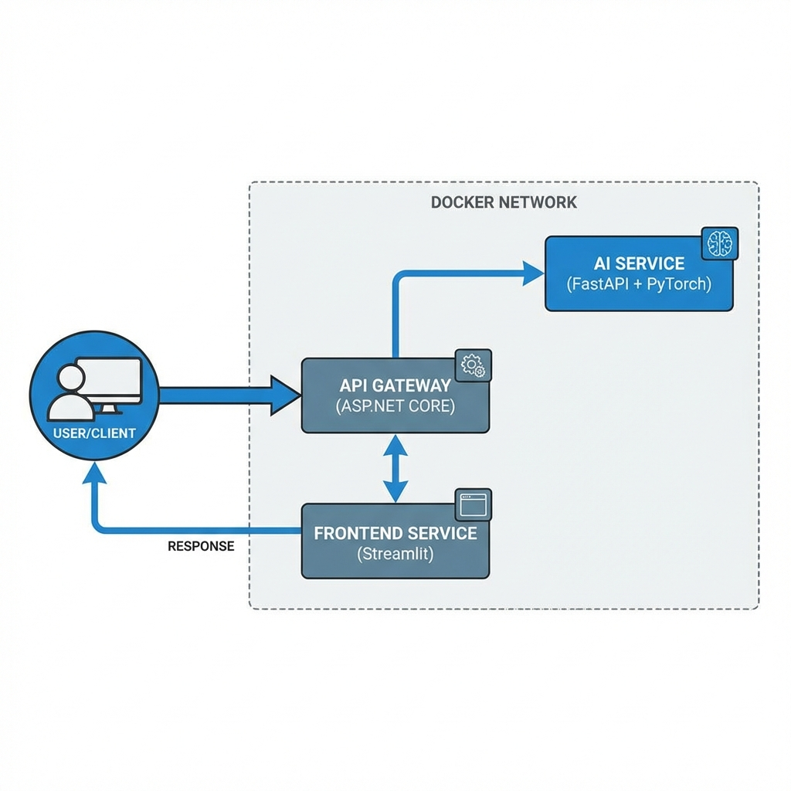

# 🚀 Microservices Dockerized AI System


A production-grade, microservices-based AI system demonstrating modern architectural patterns, container orchestration, and scalable deployment strategies. This project separates concerns by isolating the AI inference logic, API management, and user interface into distinct, containerized services.

## 🎯 Objectives
-   **Microservices Architecture**: Demonstrate clear separation of concerns between AI, Backend, and Frontend.
-   **Scalability**: Show how to scale AI services independently of the API gateway.
-   **Resilience**: Implement Circuit Breaker patterns to handle service failures gracefully.
-   **DevOps**: Provide full Dockerization, Kubernetes manifests, and CI/CD pipelines.

## 🏗️ Architecture Overview

The system is composed of three main services communicating over a private Docker network (or K8s cluster):

1.  **Frontend Service** (Streamlit): A user-friendly interface for sending text to be analyzed.
2.  **API Gateway** (.NET Core): The entry point that manages routing, load balancing, and resilience (Polly Circuit Breaker).
3.  **AI Service** (FastAPI + PyTorch): The compute-heavy worker that hosts the sentiment analysis model.

[Read more about the Architecture](docs/architecture.md)



*Figure 1: High-level architecture showing the flow of requests from User to Frontend, Gateway, and AI Service.*


## 🛠️ Technology Stack

| Component | Technology | Justification |
| :--- | :--- | :--- |
| **AI Service** | Python, FastAPI, PyTorch | standard for ML; FastAPI provides high-performance async I/O. |
| **API Gateway** | C#, .NET 8, Polly | High-throughput, strongly typed, enterprise-grade resilience patterns. |
| **Frontend** | Python, Streamlit | Rapid UI development for data science demonstrations. |
| **Containerization** | Docker | Consistent environments across dev and prod. |
| **Orchestration** | Kubernetes | Production-grade scaling and management. |

## 📋 Prerequisites

-   **Docker Desktop** (running Linux containers)
-   **Git**

## 🚀 Installation & Usage

### 1. Clone the Repository
```bash
git clone https://github.com/yourusername/Microservices-Dockerized-AI.git
cd Microservices-Dockerized-AI
```

### 2. Run with Docker Compose
The easiest way to start the entire stack:

```bash
docker-compose up --build
```

Wait for a few minutes for the images to build and the model to download (in the AI service).

### 3. Access the Application
-   **Frontend UI**: Open [http://localhost:8501](http://localhost:8501) in your browser.
-   **API Gateway Swagger**: Open [http://localhost:5000/swagger](http://localhost:5000/swagger) for API docs.
-   **Health Checks**:
    -   AI Service: `http://localhost:8000/health`
    -   API Gateway: `http://localhost:5000/api/inference/health`

### 4. Stop the Services
```bash
docker-compose down
```

## 📡 API Endpoints

### POST `/api/Inference`
Submits text for sentiment analysis.

**Request:**
```json
{
  "text": "I am amazed by how well microservices work together!"
}
```

**Response:**
```json
{
  "text": "I am amazed by how well microservices work together!",
  "sentiment": "POSITIVE",
  "confidence": 0.9998,
  "model_version": "distilbert-base-uncased-finetuned-sst-2-english"
}
```

## 🐳 Docker Commands

-   **Build Images**: `docker-compose build`
-   **Run in Background**: `docker-compose up -d`
-   **View Logs**: `docker-compose logs -f`
-   **View Service Status**: `docker ps`

[Read detailed Docker explanation](docs/docker_explained.md)

## ☸️ Kubernetes Deployment

If you have a local Kubernetes cluster (like Minikube or Docker Desktop K8s):

```bash
# 1. Create Namespace
kubectl apply -f kubernetes/namespace.yaml

# 2. Deploy Services
kubectl apply -f kubernetes/ai-deployment.yaml
kubectl apply -f kubernetes/api-deployment.yaml

# 3. Setup Ingress (Optional)
kubectl apply -f kubernetes/ingress.yaml
```

[Read Kubernetes Guide](docs/kubernetes_intro.md)

## 📂 Project Structure

-   `services/`
    -   `ai-service/`: FastAPI application with PyTorch model.
    -   `api-gateway/`: .NET Core Web API acting as the gateway.
    -   `frontend-service/`: Streamlit UI.
-   `kubernetes/`: YAML manifests for deployment, services, and ingress.
-   `ci-cd/`: GitHub Actions workflow config.
-   `docs/`: Detailed architectural and concept documentation.
-   `outputs/`: Sample logs and diagrams generated from execution.

## 📊 Results & Artifacts

You can inspect the `outputs/` directory for evidence of the system's operation:
-   [API Responses](./outputs/api_responses.json): Captured JSON responses.

-   [Docker Logs](./outputs/docker_logs.txt): Real runtime logs showing successful communication.

## 🔧 Troubleshooting

-   **Model Download Fail**: The first run takes time to download the model (~250MB). Check logs: `docker-compose logs ai-service`.
-   **Connection Refused**: Ensure the API Gateway starts *after* the AI service is healthy (Docker Compose handles this, but give it a moment).

---

## 👤 Author
 
Furkan Karakaya
AI & Computer Vision Engineer
 
📧 se.furkankarakaya@gmail.com
 
## ⭐ If this project helps your workflow or research, consider starring the repository.
